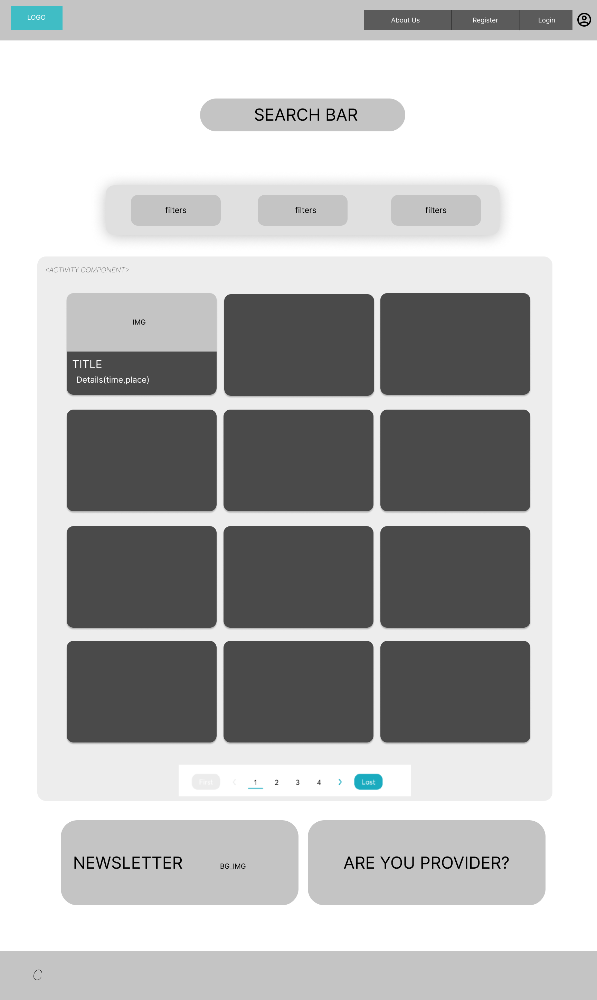
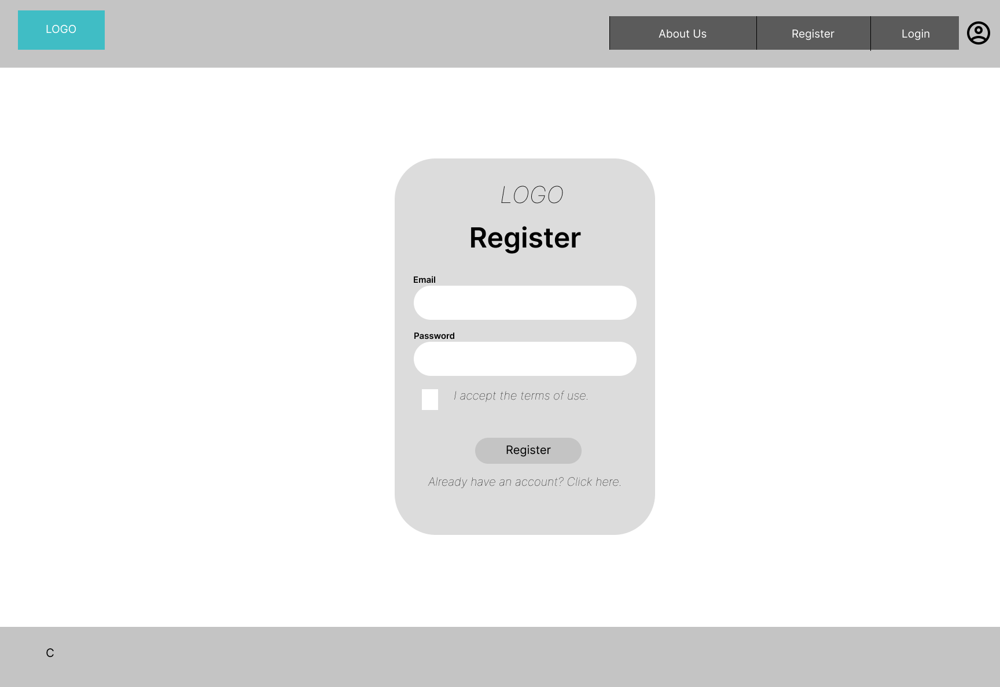
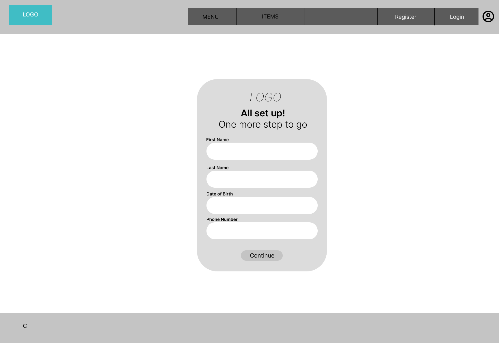
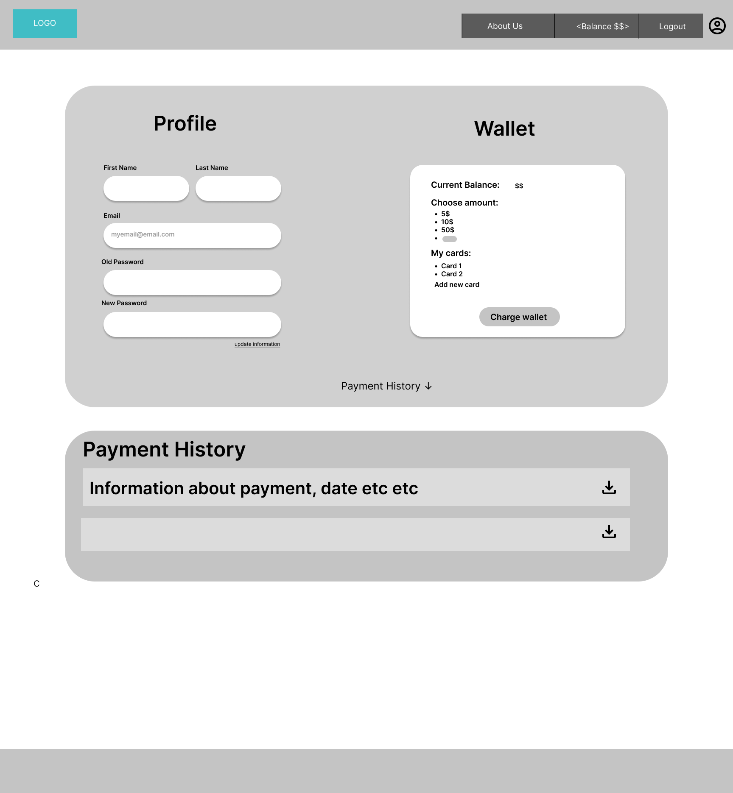
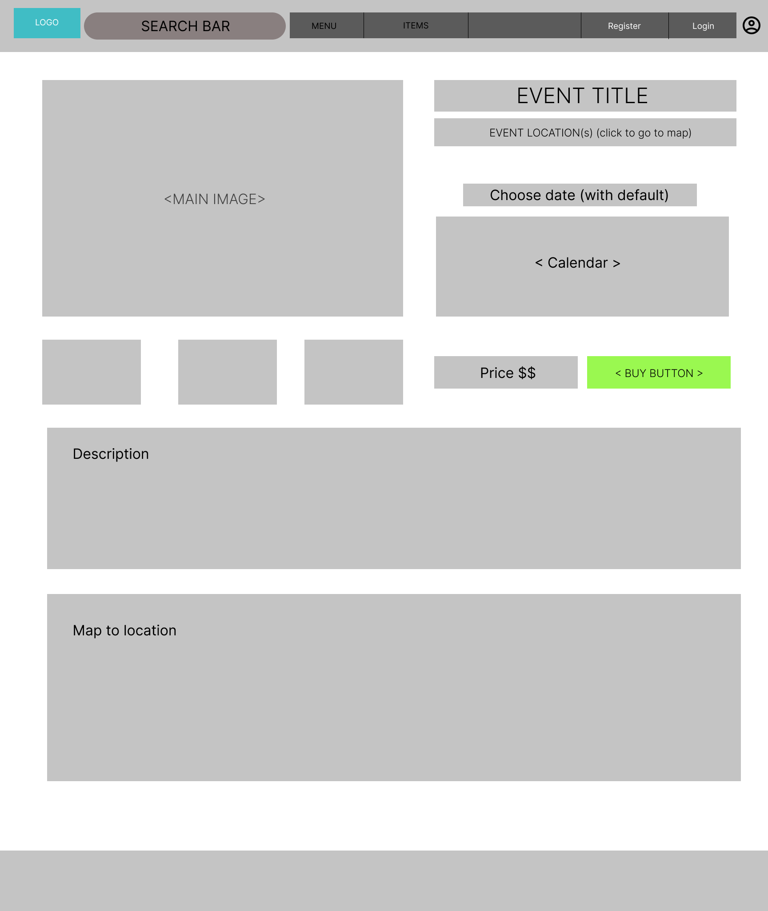
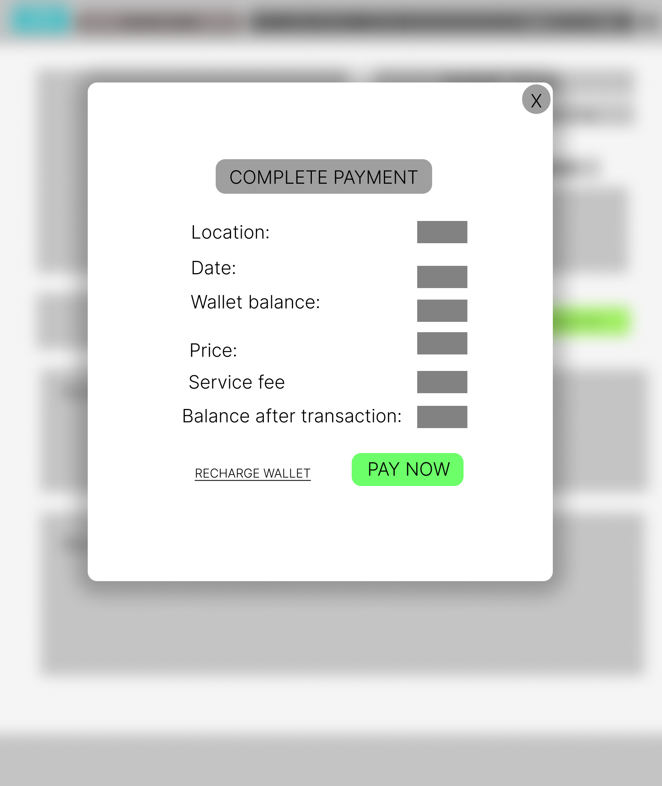
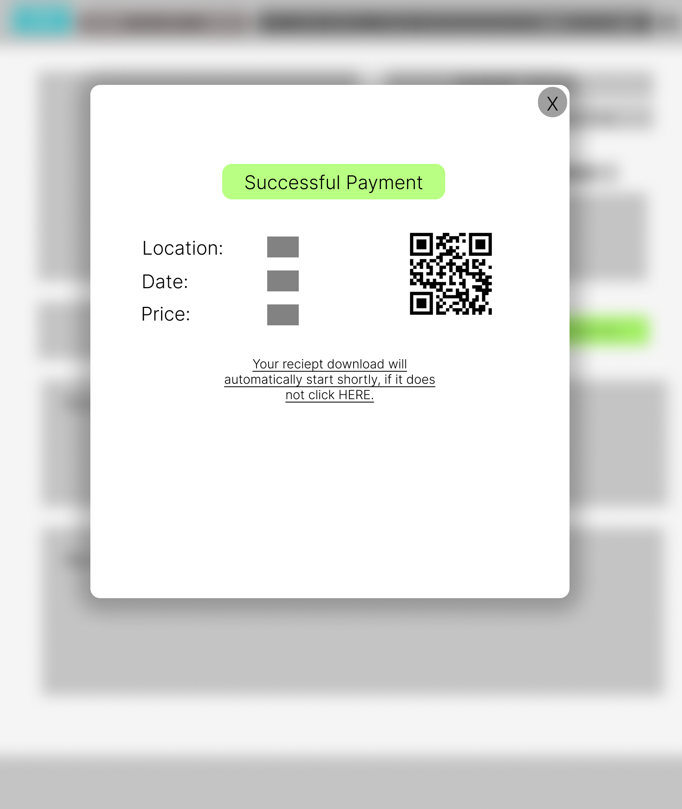
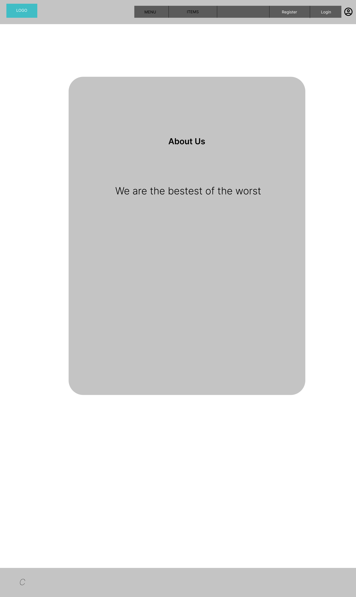

### Index Page
Αυτή θα είναι η αρχική σελίδα που θα βλέπει ο χρήστης μόλις εισέρχεται στην ιστοσελίδα, που δείχνει τα Events τα οποία μπορεί να δει και να αγοράσει (εισιτήριο για να συμμετέχει). Όποιος εισέρχεται στη σελίδα θα είναι απευθείας ανώνυμος χρήστης . Θα μπορεί να δει δηλαδή όλα τα events , να τα ψάξει αλλά δεν θα μπορεί να αγοράσει εισιτήριο . Αντίστοιχα ο parent χρήστης θα μπορεί να κάνει τα παραπάνω , αλλά και πατώντας σε ένα event θα έχει την επιλογή να το αγοράσει. 

### LogIn Page
Στην περίπτωση που ο χρήστης έχει ήδη λογαριασμό μπορεί από το navigation bar να πατήσει login, οπού εκεί θα χρειαστεί να δώσει τα στοιχειά του για να συνδεθεί στον λογαριασμό του.

### Register Page
Στην περίπτωση που ο χρήστης δεν έχει κάποιο λογαριασμό στην σελίδα, τότε απλά πηγαίνει στο register δίνει τα στοιχειά που θα χρειάζεται για να κάνει login στον λογαριασμό μετά, 

και στο δεύτερο και τελευταίο βήμα συμπληρώνει τα προσωπικά του στοιχειά.

### Profile Page
Η σελίδα αυτή , είναι αυτή που θα βλέπει ο χρήστης πατώντας πάνω στο user icon που βρίσκεται στο nav-bar σε κάθε σελίδα. Εδώ θα μπορεί να βλέπει και να αλλάζει τις προσωπικές του πληροφορίες , να φορτίσει το ηλεκτρονικό του πορτοφόλι ,να προσθέσει και να αφαιρεί πιστωτικές κάρτες. Επιπλέον θα μπορεί να δει τις προηγούμενες του αγορές καθώς και να κατεβάσει τα εισιτήρια του. 

### Event Page
Αυτή η σελίδα θα εμφανίζεται όταν ο χρήστης πατήσει πάνω σε ένα event και περιέχει περισσότερες πληροφορίες για αυτό , όπως ημερομηνία , ώρα, περιγραφή, τοποθεσία και τιμή της εκδήλωσης . Σε περίπτωση που ο χρήστης έχει συνδεθεί με το λογαριασμό του ως parent , θα μπορεί να αγοράσει εισιτήριο για την εκδήλωση αυτή. 

Αφού ο parent πατήσει να αγοράσει κάποιο εισιτήριο ελέγχεται αν το υπόλοιπο είναι αρκετό και αν ναι προχωράει στην πίστωση του χρήστη και την έκδοση του εισιτηρίου.

Σε περίπτωση που δεν έχει υπόλοιπο για την αγορά θα μπορεί να κάνει redirect για να φορτίσει το ηλεκτρονικό του πορτοφόλι.

### About us Page

