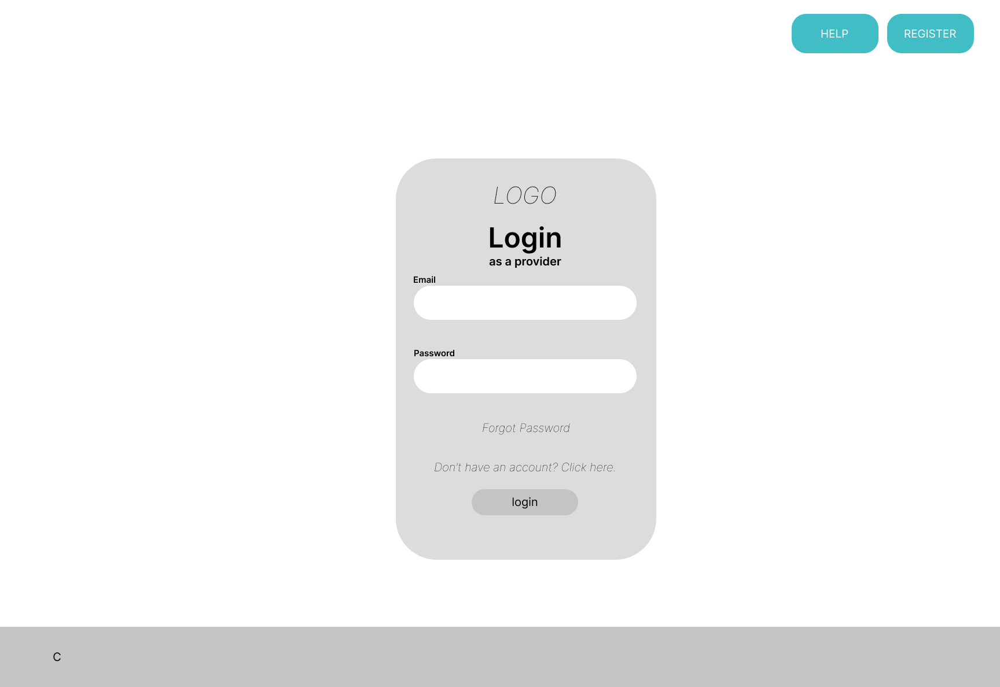
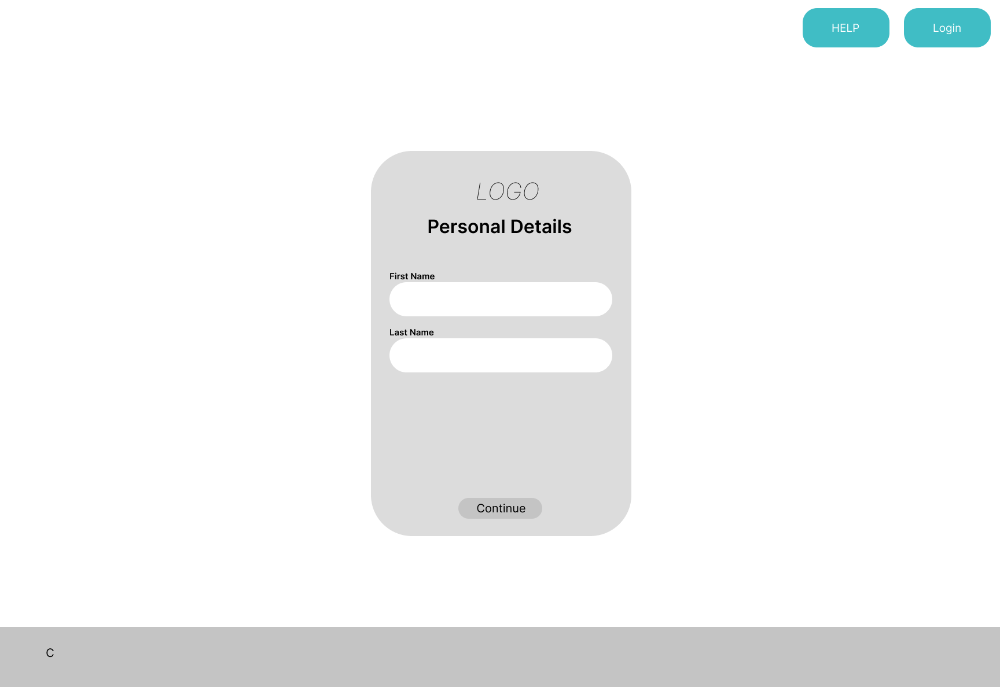
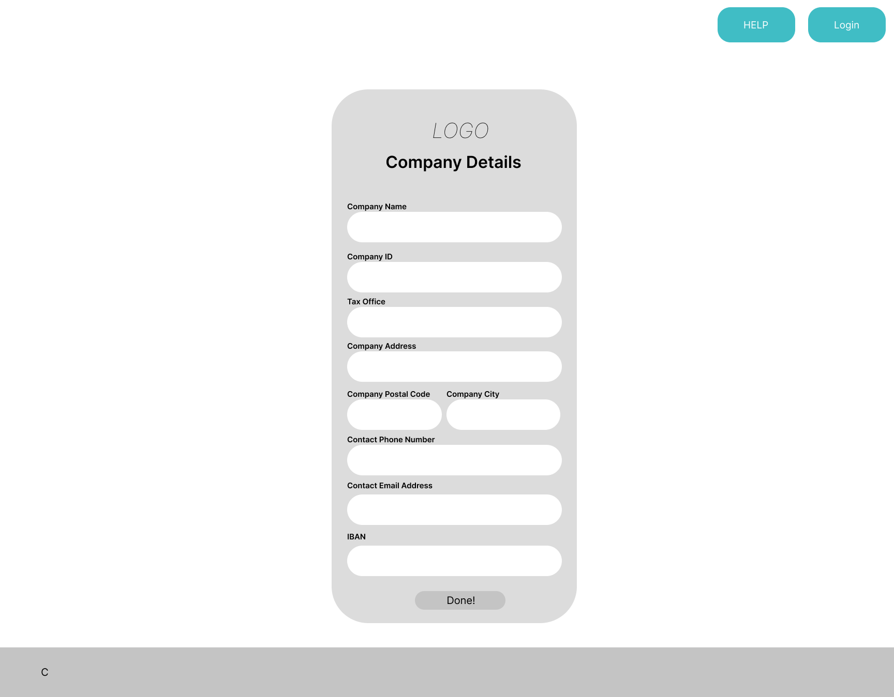
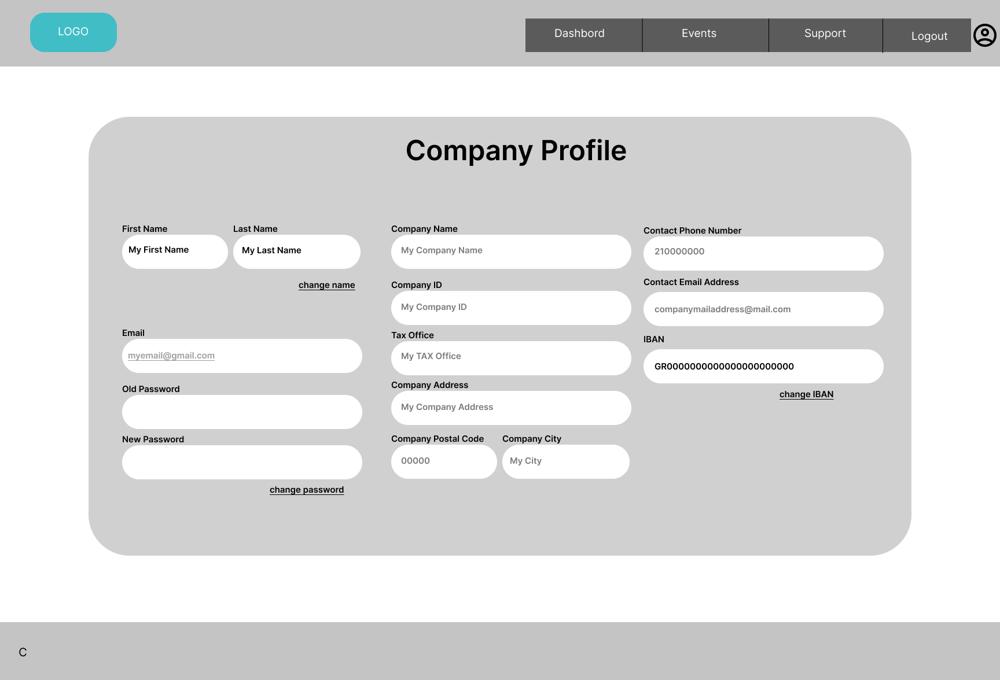
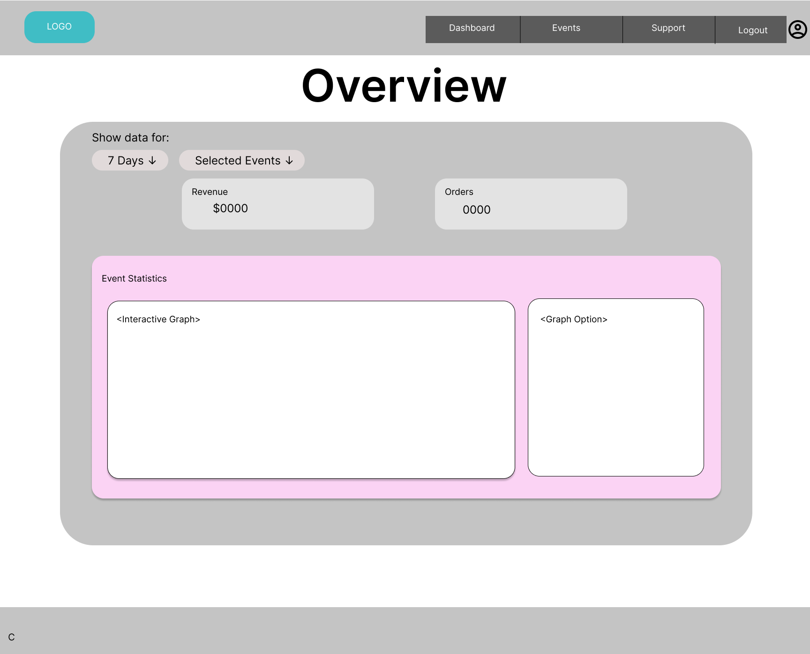
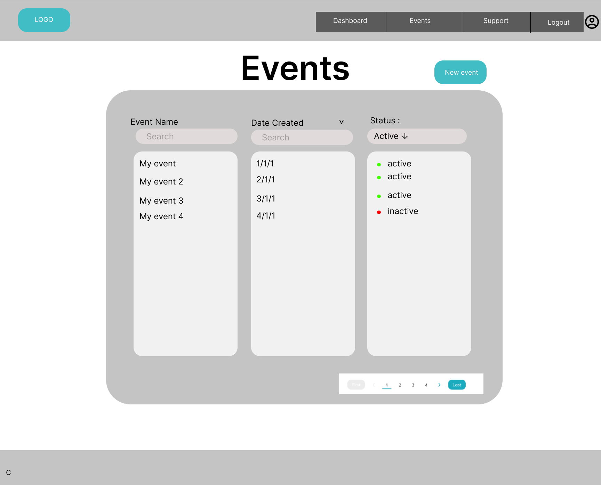
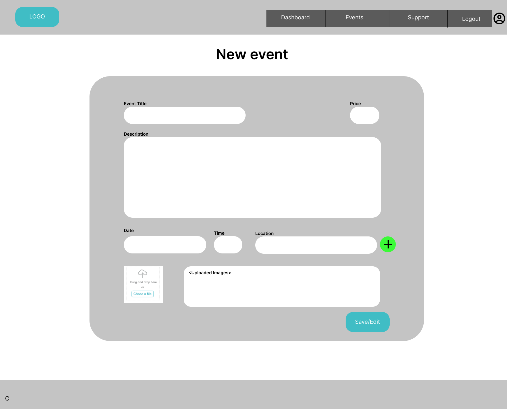
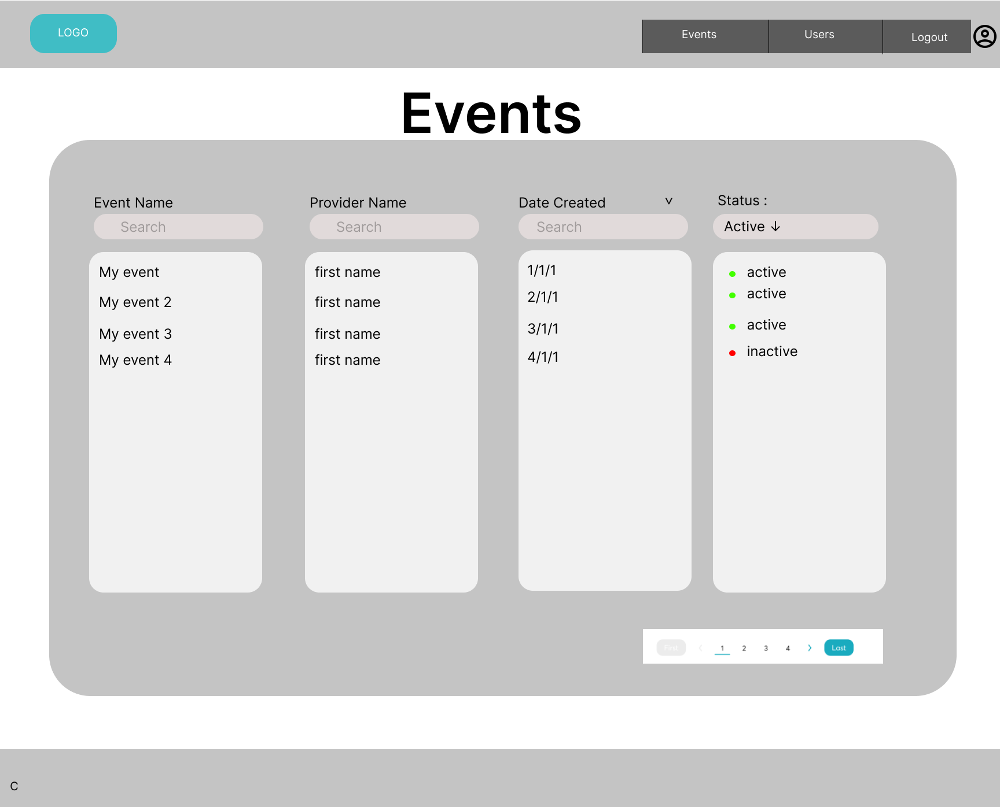
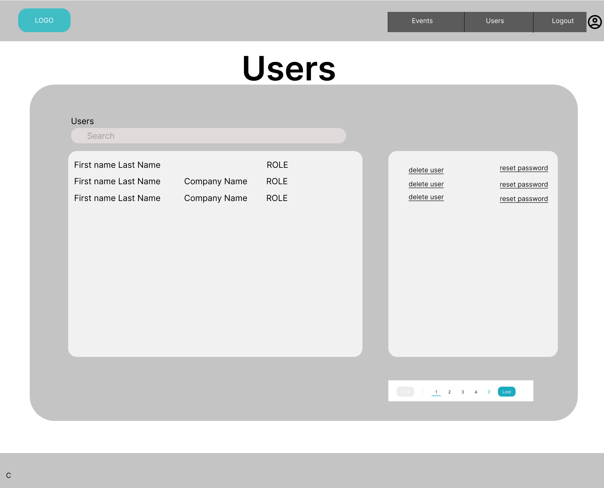

### Index
Ο κάθε χρήστης ξεκινάει από anonymous, στην περίπτωση που ο χρήστης είναι provider τότε θα πρέπει να πάει στο τέλος της index σελίδας και να πατήσει ότι είναι provider. Μετά από αυτό θα τον κάνει redirect στην σελίδα login των provider οπού εκεί θα μπορεί ή να κάνει register ή να συνδεθεί με τον προσωπικό του λογαριασμό σαν provider χρήστης.

### Login Page

### Register Page

### Profile Page
Στην σελίδα αυτή δίνεται η δυνατότητα στον χρήστη να ελέγξει τα στοιχειά που έδωσε κατά την εγγραφή, καθώς και να αλλάξει στοιχειά όπως το όνομα, επώνυμο, κωδικό και το IBAN του. Τα υπόλοιπα στοιχειά, αφού μιλάμε για εταιρία, μπορούν να αλλάξουν μονό από τον admin με την αντίστοιχη αίτηση από τον χρήστη

### Overview Page
Στην σελίδα αυτή ο χρήστης μπορεί να δει τα στατιστικά του ανάλογα με το time table που έχει δώσει Εμφανίζονται τα εισιτήρια που έχει πουλήσει, το ποσό που κέρδισε, graphs με τα αντίστοιχα δεδομένα ανά ήμερα κλπ.

### Events Page
Στην σελίδα αυτή εμφανίζονται όλα τα events που έχει καταχωρήσει ο provider. Δίνεται η δυνατότητα να κάνει search με το όνομα ή την ημερομηνία του κάθε event άλλα και να δει το status του κάθε event. Τέλος, υπάρχει και η δυνατότητα να διαγράψει, να κάνει edit και να δημιουργήσει ένα νέο event. 

### New Event Page
Αυτή η σελίδα χρησιμοποιείται για να φτιάξει ο χρήστης κάποιο καινούργιο event ή αν κάνει edit, έχει προσυμπληρωμένα τα πεδία 

Μπορεί να έχει πολλές ημερομηνίες, ώρες και τοποθεσίες και αντίστοιχα ότι άλλο χρειάζεται.

### Help Page

# Admin
Η σελίδα του admin ουσιαστικά σχεδιάστηκε πάνω στην σελίδα του provider, με μονή διάφορα στην events page και προστέθηκε και η users page.

### Events Page
Μονή διάφορα με το αντίστοιχο του provider είναι ότι βλέπει τα events όλων των providers και δίνεται η δυνατότητα να κάνει search ανάλογα με το όνομα του κάθε provider.

### Users Page
Ο admin μπορεί να δει όλους τους χρήστες, να κάνει search ανάλογα με το όνομα τους και να τους διαχειριστεί. 

